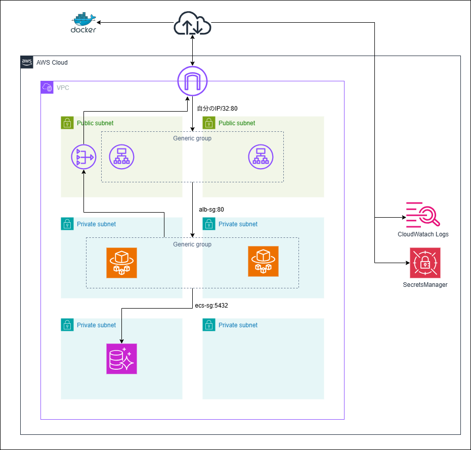
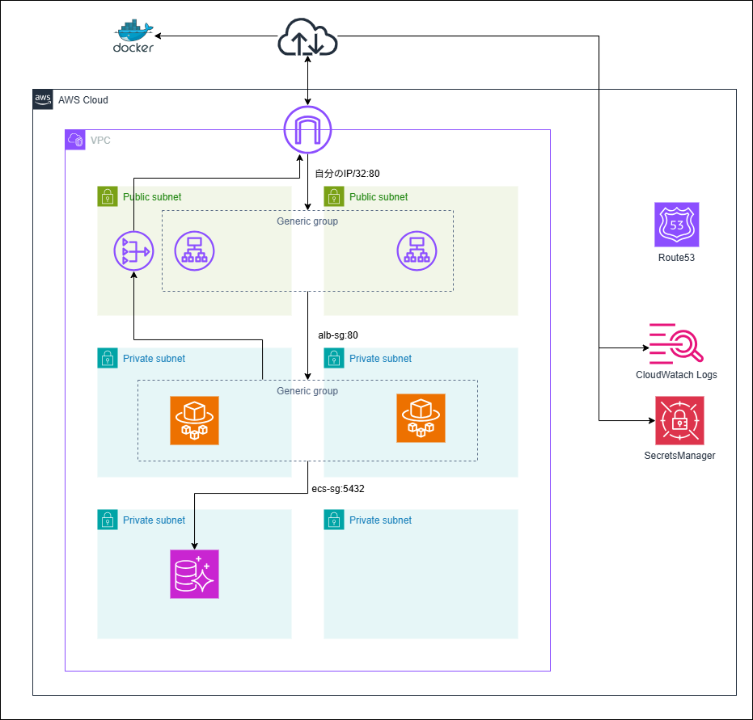
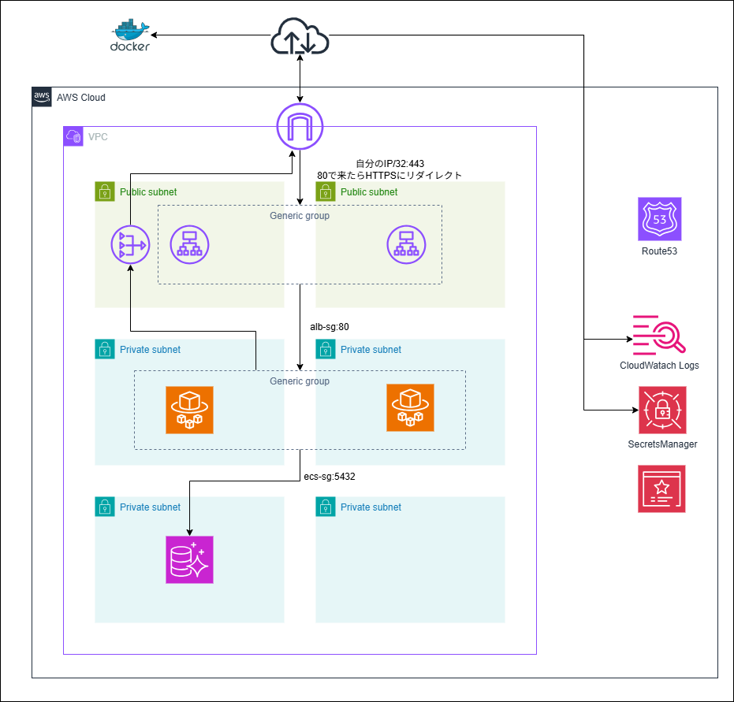
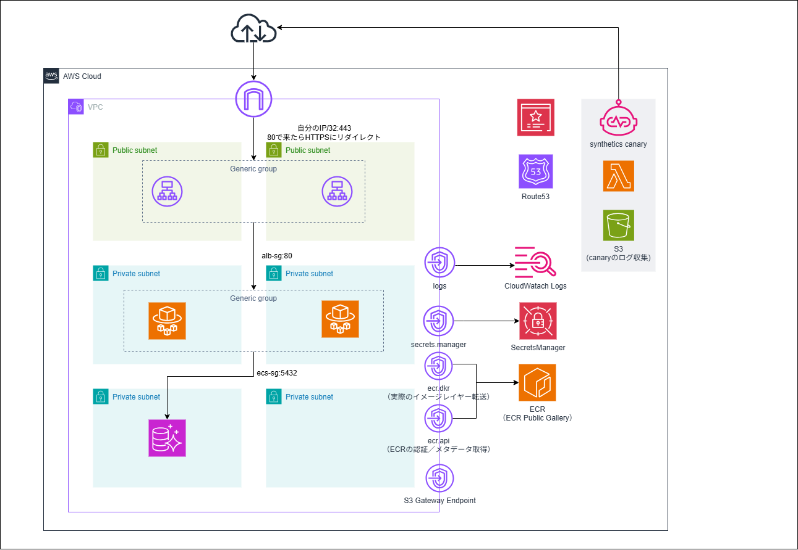
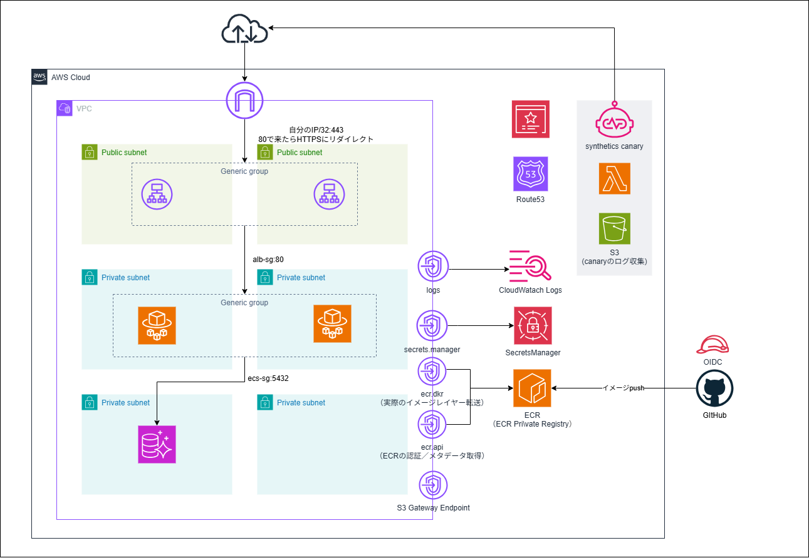

# 01_ecs_3tier_webapp

ECS Fargate による3層 Web アプリケーション基盤。
v1.0 のベース構成から段階的に機能を追加し、本番運用を意識した構成まで発展させている。

## 構成サービス

VPC, ALB, ECS Fargate, RDS (Aurora Serverless v2), ECR, Secrets Manager, Route53, ACM, CloudWatch Synthetics

## アーキテクチャの変遷

### v1.0 ベース構成



- NAT Gateway 経由で DockerHub からイメージ取得
- NAT Gateway 経由で Secrets Manager / CloudWatch Logs にアクセス

### v1.1 Route53 ドメインルーティング



### v1.2 HTTPS 化



- ACM 証明書を ALB の HTTPS リスナーにアタッチ

### v1.3 ECR からのイメージ取得


- DockerHub → ECR プライベートリポジトリに変更

### v1.4 アウトバウンド通信の閉域化


- NAT Gateway を廃止し、VPC エンドポイント（ECR×3 + Logs + Secrets Manager）に置き換え

### v1.5 外形監視



- CloudWatch Synthetics Canary による外形監視を追加

### v1.6 GitHub Actions CI/CD



- GitHub Actions から OIDC 認証で ECR にイメージ push

## デプロイ

```bash
cd cdk
npm install
npx cdk deploy --profile <PROFILE>
```

`parameter.ts` のプレースホルダーを環境に合わせて書き換えてからデプロイすること。
