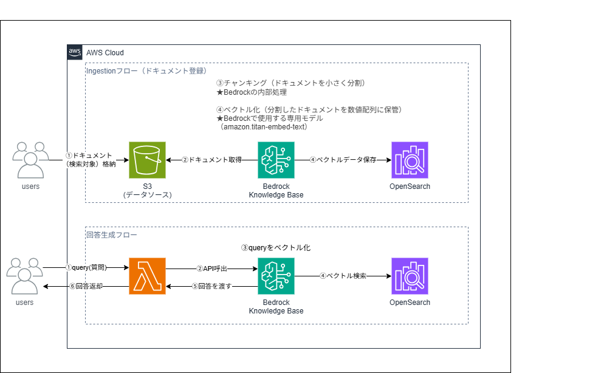

# 01_rag_document_search

RAG ベースの社内ドキュメント検索ボット。

## 構成サービス

- Amazon Bedrock Knowledge Base
- S3
- Lambda
- CDK (TypeScript)
- Slack or Web UI

## 学べること

- RAG アーキテクチャの設計・実装
- Bedrock Knowledge Base のセットアップ
- ベクトル検索の基礎（OpenSearch Serverless）
- プロンプトエンジニアリング

## ステータス

- [x] 設計
- [x] 実装
- [x] 検証

## CDK スタック構成

デプロイ順に依存関係がある。`cdk deploy --all` で一括デプロイ可能。

```text
DatasourceStack
  └─ IamStack
       └─ OpenSearchStack
            └─ KnowledgeBaseStack
                 └─ ComputeStack
```

### DatasourceStack（`lib/datasource-stack.ts`）

RAG のデータソースとなる S3 バケットを管理する。

| リソース | 内容 |
| --- | --- |
| S3 Bucket | ドキュメント格納先。SSL強制・パブリックアクセス全ブロック・スタック削除時に自動削除 |

#### 出力

- `bucket`: KnowledgeBaseStack・IamStack に渡す

---

### IamStack（`lib/iam-stack.ts`）

Bedrock Knowledge Base の実行ロールを管理する。  
OpenSearchStack より先に作成することで、ロール ARN を DataAccessPolicy に登録できる（循環参照を回避するための分離）。

| リソース | 内容 |
| --- | --- |
| KnowledgeBaseRole | Bedrock が AssumeRole する IAM ロール |

#### KnowledgeBaseRole に付与する権限

| アクション | 対象 | 用途 |
| --- | --- | --- |
| `s3:GetObject` / `s3:ListBucket` | DocumentBucket | Ingestion 時のドキュメント取得 |
| `bedrock:InvokeModel` | Titan Embed Text v2 | ベクトル化 |
| `aoss:APIAccessAll` | `*` | OpenSearch Serverless データプレーンへのアクセス |

> `aoss:APIAccessAll` のリソース指定は `*` のみ有効（コレクション ARN での絞り込み不可）。

#### 出力

- `knowledgeBaseRole`: OpenSearchStack・KnowledgeBaseStack に渡す

---

### OpenSearchStack（`lib/opensearch-stack.ts`）

ベクトルストアとなる OpenSearch Serverless コレクションと、インデックスを自動作成する Custom Resource を管理する。

| リソース | 内容 |
| --- | --- |
| EncryptionPolicy | コレクションの暗号化ポリシー（AWS マネージドキー） |
| NetworkPolicy | パブリックエンドポイントを許可するネットワークポリシー |
| Collection | VECTORSEARCH タイプのコレクション |
| IndexCreatorRole | Custom Resource Lambda の実行ロール（`roleName` 固定） |
| DataAccessPolicy | KnowledgeBaseRole と IndexCreatorRole にインデックス操作権限を付与 |
| RequestsLayer | `requests` + `requests-aws4auth` の Lambda Layer |
| IndexCreatorFunction | コレクション作成後にインデックスを自動作成・削除する Lambda |
| IndexCreatorProvider | Custom Resource のプロバイダー |
| IndexCreator | CFn のライフサイクルに乗せる Custom Resource 本体 |

#### 設計上の注意点

- `DataAccessPolicy` の `policy` は `cdk.Fn.sub` で組み立てる（`JSON.stringify` は CFn トークンを解決できないため）
- `IndexCreator` は `DataAccessPolicy` への `addDependency` で実行順序を保証する
- `IndexCreatorRole` は `roleName` を固定する（スタック再作成時に ARN が変わると DataAccessPolicy の Principal と不一致になるため）
- OpenSearch Serverless への署名は `requests-aws4auth` を使う（`botocore.SigV4Auth` + `urllib` は IAM ロールの AssumedRole セッションで 403 になる）

詳細は [OpenSearch Serverless 403エラー トラブルシューティング](./docs/opensearch-403-troubleshooting.md) を参照。

#### エクスポート定数（KnowledgeBaseStack で使用）

```typescript
export const VECTOR_INDEX_NAME = 'rag-index';
export const VECTOR_FIELD_NAME = 'embedding';
export const TEXT_FIELD_NAME  = 'text';
export const METADATA_FIELD_NAME = 'metadata';
```

#### 出力

- `collectionArn`: KnowledgeBaseStack に渡す
- `collectionEndpoint`: IndexCreatorFunction の環境変数として使用

---

### KnowledgeBaseStack（`lib/knowledge-base-stack.ts`）

Bedrock Knowledge Base 本体と S3 データソースを管理する。

| リソース | 内容 |
| --- | --- |
| KnowledgeBase | ベクトル型 Knowledge Base。ベクトルストアに OpenSearch Serverless を指定 |
| DataSource | S3 バケットをデータソースとして登録。チャンキング戦略は FIXED_SIZE（300トークン / オーバーラップ20%） |

#### チャンキング設定

```typescript
chunkingStrategy: 'FIXED_SIZE',
fixedSizeChunkingConfiguration: {
  maxTokens: 300,
  overlapPercentage: 20,
}
```

詳細は [チャンキング戦略](./docs/chunking-strategy.md) を参照。

#### 出力

- `knowledgeBaseId`: ComputeStack に渡す
- `knowledgeBaseArn`: ComputeStack に渡す

---

### ComputeStack（`lib/compute-stack.ts`）

ユーザーからの質問を受け取り、Knowledge Base に問い合わせて回答を返す Lambda を管理する。

| リソース | 内容 |
| --- | --- |
| RagFunction | `retrieve_and_generate` API を呼び出す Lambda（Python 3.12） |

#### RagFunction に付与する権限

| アクション | 対象 | 用途 |
| --- | --- | --- |
| `bedrock:RetrieveAndGenerate` | `*` | Retrieve & Generate API の呼び出し |
| `bedrock:Retrieve` | KnowledgeBase ARN | Retrieve API の呼び出し |
| `bedrock:InvokeModel` | Nova Lite ARN | 回答生成モデルの呼び出し |

#### Lambda の入出力

```json
// 入力
{ "query": "質問テキスト" }

// 出力
{
  "answer": "回答テキスト",
  "citations": [{ "チャンクの出典情報" }]
}
```

---

## Lambda Layer のセットアップ（初回のみ）

```bash
mkdir -p cdk/lambda-layer/python
pip install requests requests-aws4auth -t cdk/lambda-layer/python
```

`lambda-layer/` は `.gitignore` に追加済みのためコミット不要。

---

## デプロイ手順

```bash
cd cdk
npm install
npm run deploy   # cdk deploy --all --require-approval never
```

## ドキュメント投入・Sync

```bash
AWS_PROFILE=<PROFILE> ./scripts/upload_and_sync.sh
```

`sample-docs/` 以下のファイルをS3にsyncし、Ingestion Jobが `COMPLETE` になるまでポーリングする。詳細は [検証手順](./docs/verification.md) を参照。

## 削除手順

```bash
npm run destroy  # cdk destroy --all
```

> ⚠️ OpenSearch Serverless は最小構成でも $350/月かかる。検証が終わったらすぐ削除すること。

## 構成図

> drawioファイルは `images/` に保管。改造のたびにPNGエクスポートして追加する。

### v1.0 ベース構成


