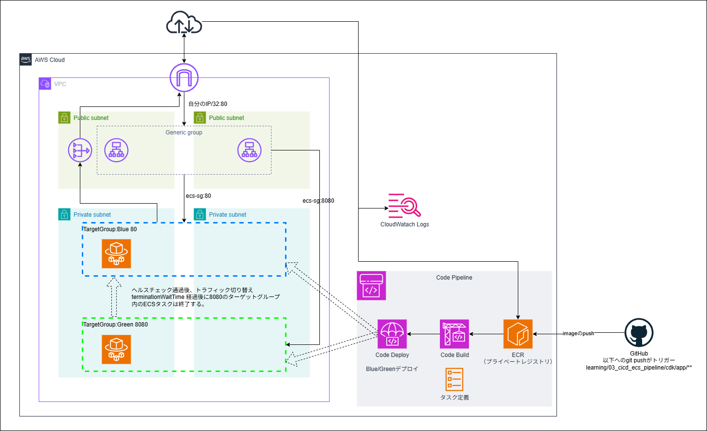

# 03_cicd_ecs_pipeline

CI/CD パイプライン（GitHub Actions + ECS）。

## 構成サービス

### v1.0（実装済み）

- GitHub Actions（OIDC 認証）
- ECR（プライベートリポジトリ）
- ECS Fargate

### v2.0（実装済み）

- GitHub Actions（ECR push のみ）
- CodePipeline
- CodeDeploy (Blue/Green)
- ECR
- ECS Fargate

## 学べること

- GitHub Actions OIDC 認証（アクセスキー不要）
- ECR へのイメージビルド・push
- ECS force-new-deployment
- CodePipeline の各ステージ設計（v2.0）
- ECS Blue/Green デプロイの仕組み（v2.0）
- 失敗時のロールバック戦略（v2.0）

## 構成図

### v1.0

```text
GitHub（main push）
  │
  └── GitHub Actions
        ├── OIDC 認証（IAM ロール AssumeRole）
        ├── Docker ビルド
        ├── ECR push（:latest）
        └── ECS force-new-deployment
```

### v2.0（実装済み）

```text
GitHub（main push）
  │
  └── GitHub Actions
        ├── OIDC 認証
        ├── Docker ビルド
        └── ECR push（:latest）
              ↓ ECR イメージ変更を EventBridge で検知
        CodePipeline
          ├── Source: ECR（imageDetail.json）
          ├── Build: CodeBuild（appspec.yaml / taskdef.json 動的生成）
          └── Deploy: CodeDeploy Blue/Green
                └── ECS（ALB :80 Blue ↔ Green 切り替え、テスト :8080）
```

## ファイル構成

```text
03_cicd_ecs_pipeline/
├── cdk/
│   ├── bin/app.ts
│   ├── lib/
│   │   ├── pipeline-stack.ts
│   │   └── constructs/
│   │       ├── network.ts       # VPC / SG
│   │       ├── ecr.ts           # ECR リポジトリ
│   │       ├── compute.ts       # ALB / ECS（Blue/Green コントローラー）
│   │       └── pipeline.ts      # CodePipeline / CodeBuild / CodeDeploy
│   ├── parameter.ts
│   ├── package.json
│   ├── tsconfig.json
│   └── cdk.json
├── docs/
│   ├── design.md
│   └── learning-check.md
└── README.md

# GitHub Actions（v2.0 用）
.github/workflows/
└── deploy-ecs-v2.yml      # ECR push のみ（force-new-deployment なし）
```

## デプロイ手順

```bash
# 1. CDK デプロイ
cd learning/03_cicd_ecs_pipeline/cdk
cdk deploy --profile <PROFILE>
```

```bash
# 2. CDK Output の ECR URI を GitHub Variables に登録
# CicdEcsPipelineStack.EcrRepositoryUri の値を ECR_REPOSITORY_V2 に設定
# CicdEcsPipelineStack.GitHubActionsRoleArn の値を AWS_ROLE_ARN_V2 に設定
```

```bash
# 3. 初回イメージ push（パイプライン初回起動用）
aws ecr get-login-password --region ap-northeast-1 --profile <PROFILE> \
  | docker login --username AWS --password-stdin <ECR_URI>
docker build -t <ECR_URI>:latest learning/03_cicd_ecs_pipeline/cdk/app
docker push <ECR_URI>:latest
```

以降は `learning/03_cicd_ecs_pipeline/cdk/app/**` を変更して `main` に push するだけ。
GitHub Actions が ECR push → CodePipeline が自動起動 → CodeDeploy Blue/Green デプロイ。

## GitHub Secrets / Variables

### v1.0（既存）

| 名前 | 種別 | 内容 |
| --- | --- | --- |
| `AWS_ROLE_ARN` | Secret | OIDC ロールの ARN |
| `AWS_REGION` | Variable | `ap-northeast-1` |
| `ECR_REPOSITORY` | Variable | `webapp` |
| `ECS_CLUSTER` | Variable | `dev-cluster` |
| `ECS_SERVICE` | Variable | `dev-service` |

### v2.0（追加）

| 名前 | 種別 | 内容 |
| --- | --- | --- |
| `AWS_ROLE_ARN_V2` | Secret | v2.0 OIDC ロールの ARN（CDK Output 参照） |
| `ECR_REPOSITORY_V2` | Variable | `webapp-v2` |

## ステータス

- [x] 設計
- [x] 実装（v1.0）
- [x] 検証（v1.0）
- [x] 設計（v2.0）
- [x] 実装（v2.0）
- [x] 検証（v2.0）

## 構成図

> drawioファイルは `images/` に保管。改造のたびにPNGエクスポートして追加する。

### v1.0 ベース構成


**ポイント**
 - GitHub OIDC認証

### v1.1 CodePipeLine/CodeBuild/CodeDeployを使用したBlue/Greenデプロイ



**ポイント**
 - Blue/Greenデプロイ