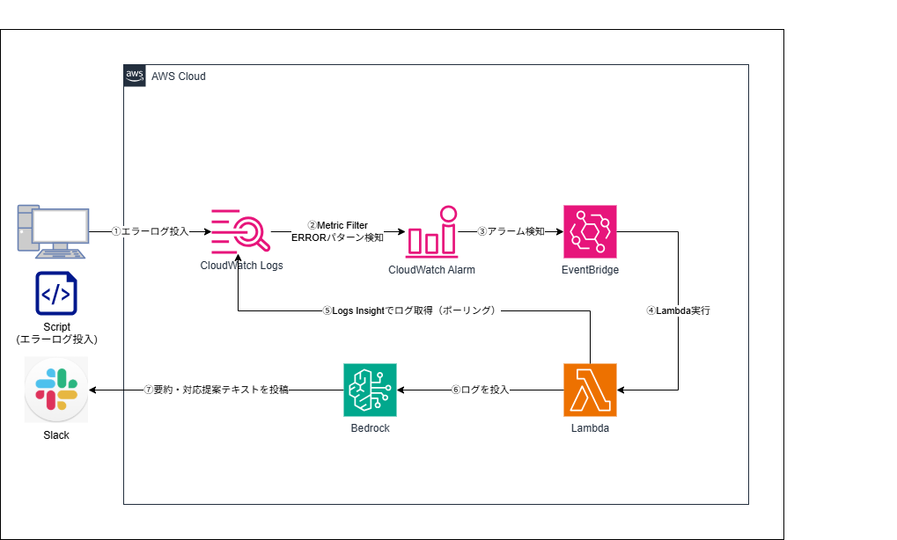

# AWS CDK Portfolio

AWS CDK (TypeScript) を使ったインフラ構築のポートフォリオ。
設計判断・段階的な構成改善・運用を意識した実装を重視しています。

## Projects

### 01. ECS 3層 Web アプリ

VPC / ALB / ECS Fargate / RDS の3層構成。v1.0 から段階的に機能を追加し、Route53・HTTPS・ECR・閉域化・外形監視・GitHub Actions CI/CD まで構築。

**主要サービス:** VPC, ALB, ECS Fargate, RDS (Aurora), ECR, CloudWatch Synthetics

→ [詳細](./01_ecs_3tier_webapp/)

---

### 02. RAG ドキュメント検索

Bedrock Knowledge Base + OpenSearch Serverless による RAG 構成。S3 上のドキュメントをベクトル化し、自然言語で検索・回答生成。

**主要サービス:** Amazon Bedrock, OpenSearch Serverless, S3, Lambda

→ [詳細](./02_rag_document_search/)

---

### 03. CI/CD パイプライン (Blue/Green)

GitHub Actions + CodePipeline + CodeDeploy による ECS Blue/Green デプロイ。ECR へのイメージ push をトリガーに自動デプロイ。

**主要サービス:** CodePipeline, CodeBuild, CodeDeploy, ECS Fargate, ECR

→ [詳細](./03_cicd_ecs_pipeline/)

---

### 04. インシデント自動対応ボット

CloudWatch Alarm → EventBridge → Lambda → Bedrock でエラーログを自動要約し、対応提案を Slack に通知。

**主要サービス:** CloudWatch, EventBridge, Lambda, Amazon Bedrock, Slack

→ [詳細](./04_incident_bot/)

## Tools

### AWS リソースインベントリツール

boto3 で AWS アカウント内のリソースを収集し、Markdown / JSON / Excel で出力する CLI ツール。未使用リソース検出・月額概算・差分比較に対応。

**技術:** Python, boto3, openpyxl, pytest

→ [詳細](./05_aws_resource_inventory/)

## 技術スタック

| カテゴリ | 技術 |
| --- | --- |
| IaC | AWS CDK (TypeScript) |
| ランタイム | Node.js, Python 3.12 |
| CI/CD | GitHub Actions, CodePipeline, CodeDeploy |
| AI/ML | Amazon Bedrock (Nova Lite, Titan Embed) |
| コンテナ | ECS Fargate, ECR |
| 監視 | CloudWatch, EventBridge, CloudWatch Synthetics |
